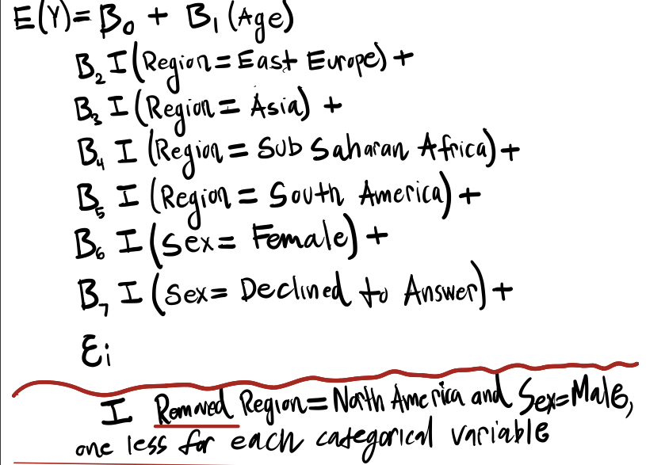
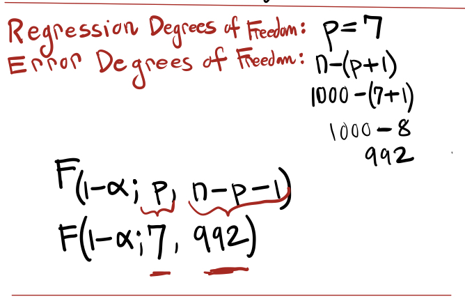

```{r message = FALSE, echo = FALSE}
library(tidyverse)
```


# PROBLEM 1A 
```{r  echo=FALSE, fig.align="center", out.width = '60%'}

```

# PROBLEM 1b
```{r  echo=FALSE, fig.align="center", out.width = '60%'}
knitr::include_graphics("Problem1b.jpeg")
```


# PROBLEM 1c
```{r  echo=FALSE, fig.align="center", out.width = '60%'}

```

# PROBLEM 1d
```{r  echo=FALSE, fig.align="center", out.width = '60%'}

```


# PROBLEM 1e
```{r  echo=FALSE, fig.align="center", out.width = '60%'}

```


\newpage

# PROBLEM 2a
```{r  echo=FALSE, fig.align="center", out.width = '60%'}
knitr::include_graphics("Problem2a.jpeg")
```


# Problem 2b
```{r  echo=FALSE, fig.align="center", out.width = '60%'}

```


# Problem 2c
```{r  echo=FALSE, fig.align="center", out.width = '60%'}

```


# Problem 2d
```{r  echo=FALSE, fig.align="center", out.width = '60%'}

```


# Problem 3
```{r  echo=FALSE, fig.align="center", out.width = '60%'}

```
